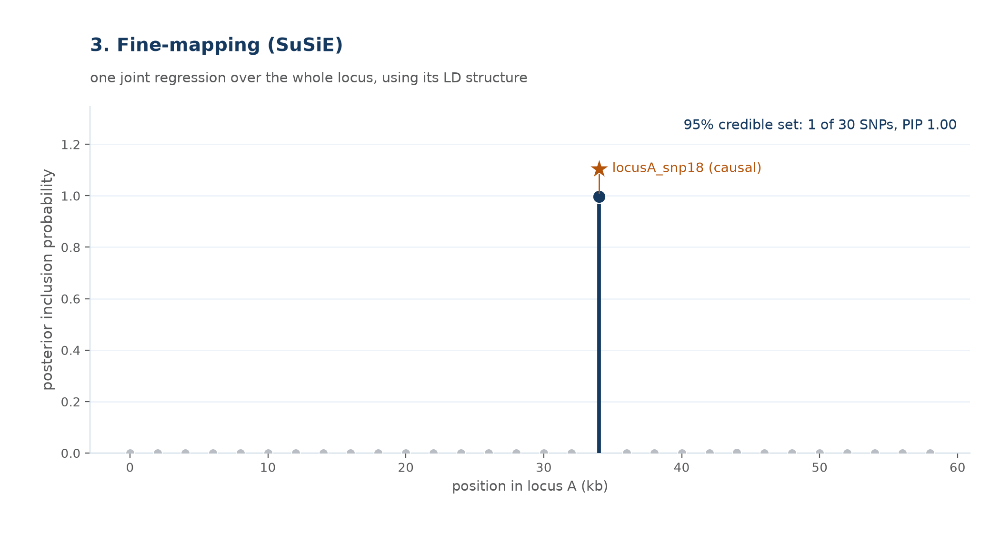

# 3. Fine-mapping — resolving the locus with SuSiE

**The idea.** Instead of testing SNPs one at a time (part 1), fit **one**
regression over every SNP in the locus defined in part 2, jointly. The
model uses the locus's own LD structure ($R$, the same matrix drawn in
part 1's neighbourhood) to work out which SNP's signal is real and which
SNPs were only ever borrowing significance from it. The output isn't a
p-value per SNP — it's a **posterior inclusion probability (PIP)**: the
probability that this specific SNP is a causal one, given all the others.

Run on locus A from part 2 (30 SNPs, same simulated genotypes, same
causal variant `locusA_snp18`) with SuSiE (`susieR::susie_rss`):

Five SNPs were genome-wide significant on their own (part 1); jointly,
SuSiE concentrates essentially all posterior mass onto the true causal
SNP, giving a 95% credible set of size 1 — the LD-driven ambiguity from
the marginal scan is resolved by modelling the SNPs together instead of
in isolation.

## The nested model, in full

The regression itself has the same shape as part 1's, just over every
SNP in the locus at once ($p=30$ here) instead of one column at a time:

$$
\begin{bmatrix} y_1 \\ y_2 \\ \vdots \\ y_n \end{bmatrix}
=
\begin{bmatrix}
x_{11} & x_{12} & \cdots & x_{1p} \\
x_{21} & x_{22} & \cdots & x_{2p} \\
\vdots & \vdots & \ddots & \vdots \\
x_{n1} & x_{n2} & \cdots & x_{np}
\end{bmatrix}
\begin{bmatrix} \beta_1 \\ \beta_2 \\ \vdots \\ \beta_p \end{bmatrix}
+
\begin{bmatrix} \varepsilon_1 \\ \varepsilon_2 \\ \vdots \\ \varepsilon_n \end{bmatrix},
\qquad \boldsymbol\varepsilon \sim \mathcal N(\mathbf 0,\, \sigma^2 I_n)
$$

SuSiE ("**Su**m of **Si**ngle **E**ffects") assumes the true effect
vector $\boldsymbol\beta \in \mathbb R^p$ is a sum of $L$ separate
**single-effect** vectors — this is the "nested" part, $L$ small
regressions nested inside the one big regression above:

$$
\boldsymbol\beta = \sum_{l=1}^{L} \mathbf b_l,
\qquad
\mathbf b_l = \boldsymbol\gamma_l \, \beta_l
$$

For each single effect $l = 1, \dots, L$:

$$
\boldsymbol\gamma_l = \begin{bmatrix} \gamma_{l,1} \\ \gamma_{l,2} \\ \vdots \\ \gamma_{l,p} \end{bmatrix} \sim \text{Categorical}(1, \boldsymbol\pi),
\qquad
\boldsymbol\gamma_l \in \{0,1\}^p,\ \ \sum_{j=1}^p \gamma_{l,j} = 1,
\qquad
\beta_l \sim \mathcal N(0, \sigma_0^2)
$$

- $L$ — number of single effects (causal signals) the model allows in this locus; a hyperparameter, set to $L=1$ here since the simulation has exactly one true causal SNP
- $\boldsymbol\gamma_l$ — a one-hot indicator vector: exactly one entry is 1, marking *which* of the $p$ SNPs is "the" variant for single effect $l$; every other entry is 0
- $\boldsymbol\pi = [\pi_1, \dots, \pi_p]^\top$ — the prior probability that each SNP is the effect variant (default: uniform, $\pi_j = 1/p$)
- $\beta_l$ — the (scalar) effect size of single effect $l$'s chosen variant, given a $\mathcal N(0, \sigma_0^2)$ prior
- $\sigma_0^2$ — prior effect-size variance, $\sigma^2$ — residual variance; both estimated from the data by `susieR`

**Posterior inclusion probability**, the quantity plotted above, for SNP
$j$:

$$
\text{PIP}_j = \Pr\!\big(\exists\, l \in \{1,\dots,L\} : \gamma_{l,j} = 1 \;\big|\; y, X\big)
\;\approx\; 1 - \prod_{l=1}^{L} \big(1 - \alpha_{l,j}\big)
$$

where $\alpha_{l,j}$ is single effect $l$'s own posterior probability
that SNP $j$ is its effect variant. The **95% credible set** annotated on
the figure is the smallest set of SNPs whose PIPs sum to at least 0.95 —
here, just `locusA_snp18` itself.
