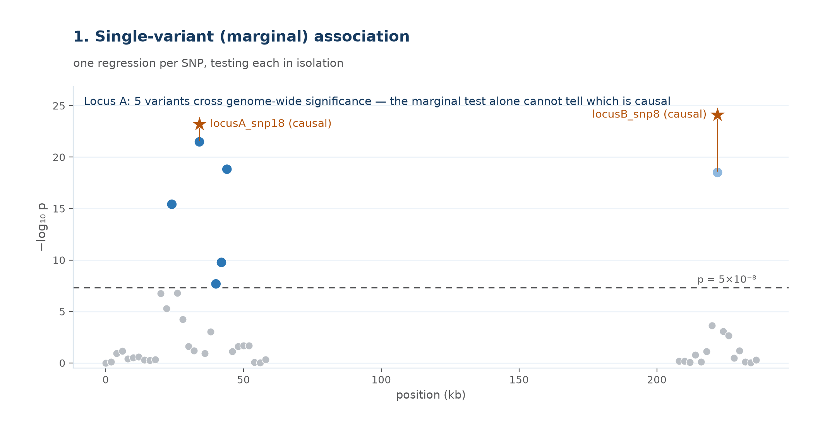

# 1. GWAS marginal association — why we test one SNP at a time

**What it is.** A genome-wide association study tests each variant
independently: for every SNP $j$ in turn, regress the phenotype on that
one SNP's genotype and record the effect size, its standard error, and a
p-value. Nothing about any other SNP enters the model. Do this once per
SNP across the whole genome (often $10^6$–$10^7$ times per study) and you
get a Manhattan plot.

**Why one at a time, not all together.** A joint regression across every
genotyped SNP simultaneously is what you'd want statistically, but it's
infeasible at genome scale: with $p \gg n$ (millions of SNPs, thousands to
hundreds of thousands of samples) the joint model isn't identifiable, and
even where it is, it's computationally prohibitive to fit genome-wide.
Marginal (one-SNP-at-a-time) regression is cheap, embarrassingly
parallel, and is what nearly every GWAS actually runs.

**The cost of that simplification.** Because SNPs near each other are
correlated (linkage disequilibrium), a marginal test doesn't only pick up
the SNP it's testing — it partly picks up every SNP correlated with it.
The figure below simulates a 50-SNP window carrying exactly **one**
true causal variant embedded in a block of near-perfect LD ($r^2 \to
1$). The marginal scan alone cannot tell which of five genome-wide
significant SNPs is the real one — they all "borrow" significance from
each other.

## The model, in full

For SNP $j$, over $n$ individuals, with genotype dosages $x_{1j},
\dots, x_{nj}$ and phenotype values $y_1, \dots, y_n$:

$$
\begin{bmatrix} y_1 \\ y_2 \\ \vdots \\ y_n \end{bmatrix}
=
\begin{bmatrix} x_{1j} \\ x_{2j} \\ \vdots \\ x_{nj} \end{bmatrix} \beta_j
+
\begin{bmatrix} \varepsilon_1 \\ \varepsilon_2 \\ \vdots \\ \varepsilon_n \end{bmatrix},
\qquad j = 1, \dots, p
$$

- $n$ — number of individuals (sample size)
- $p$ — number of SNPs in the scan; $j$ indexes the one being tested
- $x_{ij}$ — genotype dosage of individual $i$ at SNP $j$ (e.g. 0/1/2 copies of the effect allele), no other SNPs appear in this equation
- $\beta_j$ — marginal effect size of SNP $j$ on the phenotype (the single unknown being estimated)
- $\varepsilon_i \sim \mathcal N(0, \sigma^2)$ — residual for individual $i$; the vector $\boldsymbol\varepsilon$ collects all $n$ of them

Run $p$ times independently — once per SNP, each with its own $\beta_j$ —
never once with every $x_{\cdot j}$ column together.

**Why the marginal estimate gets fooled by LD.** Taking the expectation of
the standard estimator $\hat\beta_j$ under the *true* multi-SNP model
(where every SNP $k$ has its own true effect $\beta_k$) gives:

$$
\mathbb E[\hat\beta_j] = \beta_j + \sum_{k \neq j} r_{jk}\,\beta_k
$$

where $r_{jk}$ is the correlation (LD) between SNP $j$ and SNP $k$. A SNP
with zero true effect but high LD with the causal one ($r_{jk} \to 1$)
still gets a large expected marginal effect. This is exactly the gap
fine-mapping is built to close.
