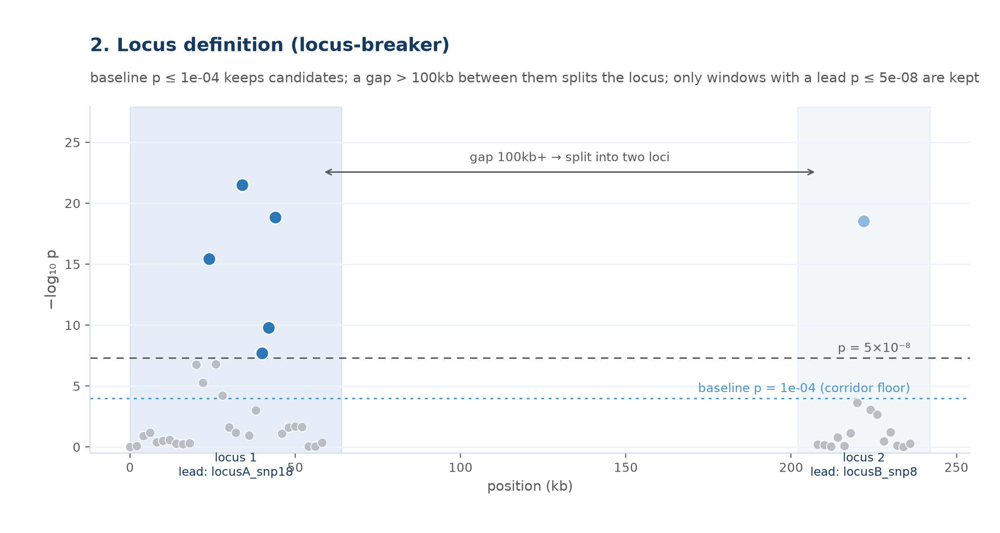

# 2. From single signal to locus — locus-breaker clumping

**The problem.** A genome-wide scan (part 1) returns a list of
significant SNPs scattered across the genome, not a list of "signals."
Neighbouring significant SNPs are usually just LD echoes of the same
underlying association; distant ones are independent. Before
fine-mapping can run, we need to decide where one locus ends and the
next begins.

**Locus-breaker**, the clumping method used in Open Targets Gentropy
(`gentropy.method.locus_breaker_clumping.LocusBreakerClumping`), does
this with a *distance-based* rule on top of two p-value thresholds,
rather than a fixed-width window around every significant hit:

1. **Baseline p-value** (loose, e.g. $p \le 10^{-4}$–$10^{-5}$) — the
   corridor floor. Only SNPs clearing this threshold are candidates for
   belonging to *any* locus; everything else is dropped before the
   distance logic even runs.
2. **Distance cutoff** — walk the surviving candidates in genomic order;
   whenever the gap between two consecutive survivors exceeds this
   distance, that's where one locus ends and the next starts.
3. **Lead p-value** (strict, genome-wide significant, e.g. $p \le
   5\times10^{-8}$) — after splitting, a window is only kept as a real
   locus if its single best (lowest-p) point clears this stricter bar.
   A stretch of only-moderately-significant baseline survivors, with no
   genome-wide-significant lead, is discarded.
4. **Flanking distance** — the kept window's start/end are each extended
   outward by this margin, so the locus isn't clipped right at its last
   significant SNP.

Gentropy's production defaults (real, chromosome-scale data): baseline
$p \le 10^{-5}$, lead $p \le 10^{-8}$, distance cutoff 250kb, flanking
100kb. The figure below rescales these to the toy window's size (baseline
$10^{-4}$, lead $5\times10^{-8}$, distance cutoff 100kb, flanking 20kb) —
same mechanics, smaller ruler.

The two signals here are 150kb apart — comfortably over the 100kb
distance cutoff — so locus-breaker correctly reports **two** loci, each
retaining its own lead SNP. Locus 1 (around `locusA_snp18`) is the one
carried forward into fine-mapping in part 3.

**Formally**, given SNPs sorted by position with p-values $p_1 \le \dots$
(in genomic order, not p-value order), restricted to $\{i : p_i \le
p_{\text{baseline}}\}$:

$$
\text{new locus at } i \iff \text{pos}_i - \text{pos}_{i-1} > d_{\text{cutoff}}
$$

and a resulting window $[\text{start}, \text{end}]$ survives only if

$$
\min_{i \,\in\, [\text{start},\, \text{end}]} p_i \;\le\; p_{\text{lead}}
$$
